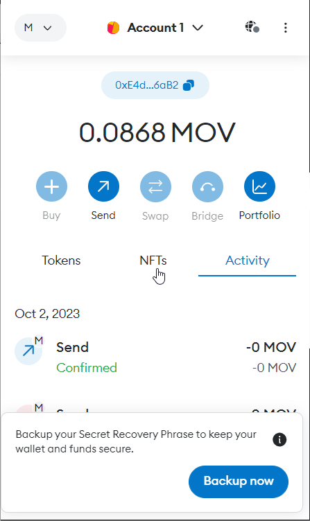
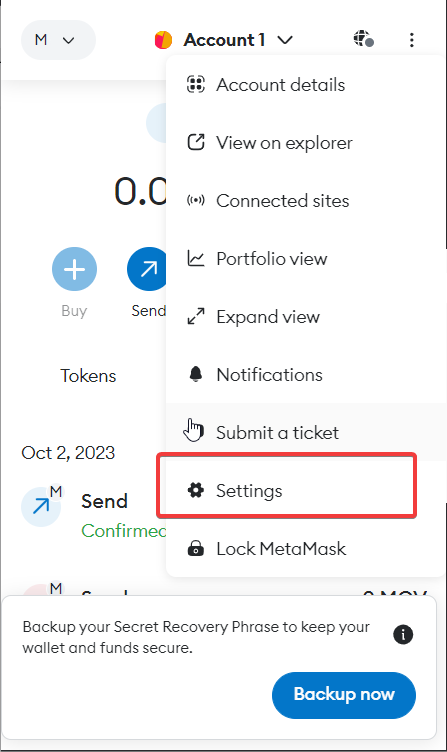
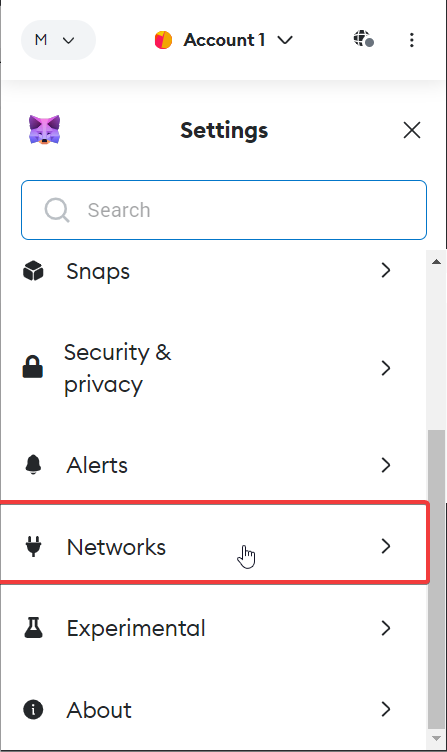
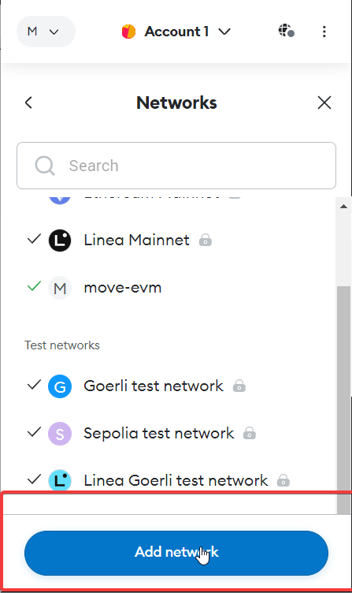
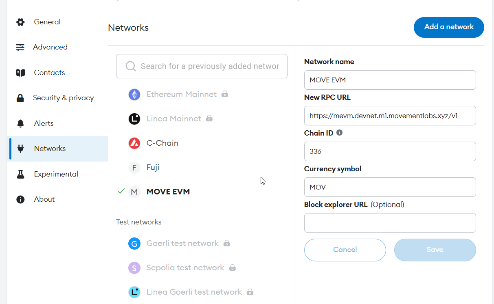
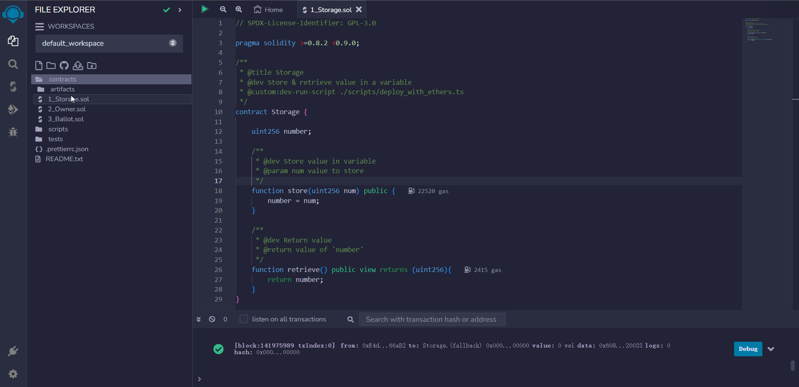
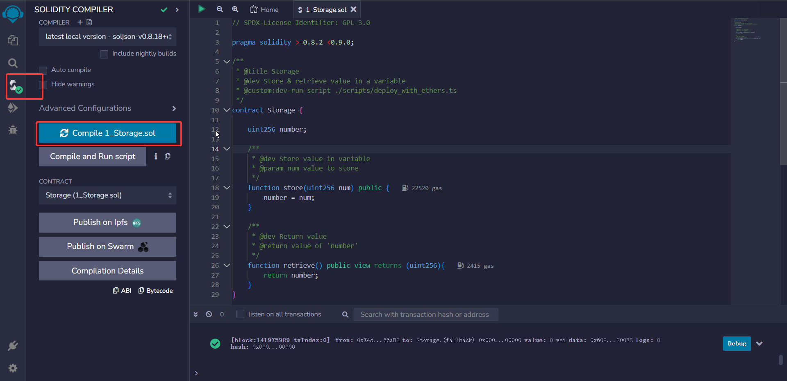
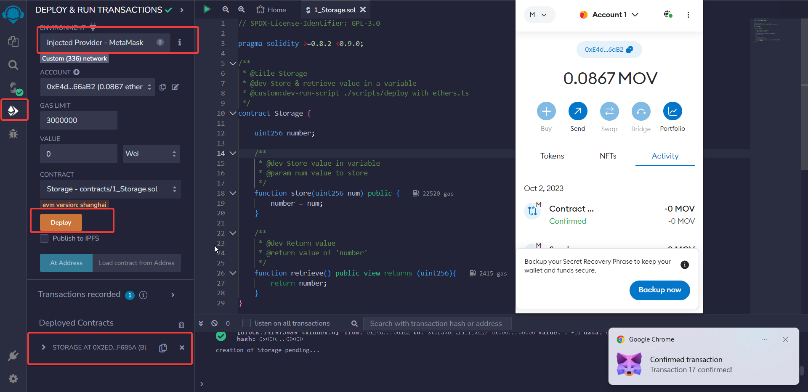
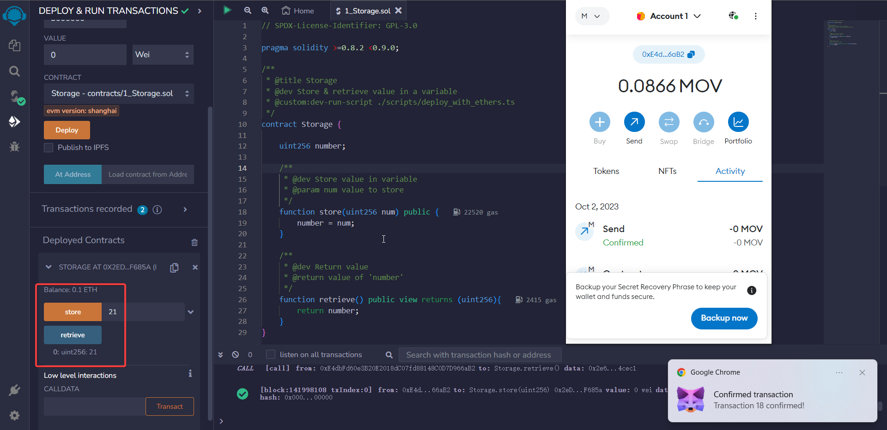

# Project Tutorial: Implementing EVM Runtime on MOVE

This project demonstrates how to:

- Call with [EVM runtime](https://github.com/movemntdev/movement-v2/blob/main/aptos-move/framework/aptos-framework/sources/evm/evm.move) on Movement Subnet.
- Implement partial Ethereum RPC methods to interact with Solidity contracts using MetaMask and Remix.
- Deploy Solidity contracts using Remix.
- Perform contract read and write operations.


### Implemented RPC Methods

The following RPC methods have been implemented to ensure interaction with Solidity contracts using MetaMask and Remix:

- `eth_chainId`: Get the chain ID, currently fixed at 336.
- `net_version`: Get the version number.
- `eth_gasPrice`: Get the current gas price.
- `eth_blockNumber`: Get the latest block number. Updated every 2 seconds.
- `eth_sendRawTransaction`: Send signed raw transaction data. This checks the correctness of the signature.
- `eth_call`: Invoke methods of smart contracts.
- `eth_getTransactionCount`: Get the transaction count for a specific address.
- `eth_getTransactionByHash`: Get transaction information based on the transaction hash.
- `eth_getTransactionReceipt`: Get the transaction receipt based on the transaction hash.
- `eth_estimateGas`: Estimate the gas consumption for a transaction. For successful transactions, if the gas is less than 21,000, it will return 21,000, but the actual consumed gas will be used when sending the transaction.
- `eth_getBlockByNumber`: Get block information based on the block number.
- `eth_getBlockByHash`: Get block information based on the block hash. Currently returns empty.
- `eth_getBalance`: Get the balance of a specific address
- `eth_getCode`: Get the code of a specific contract address.
- `eth_getStorageAt`: Get the storage at a specific position in a specific address
- `eth_getLogs`: Returns an array of all logs matching a given filter object. 
- `web3_clientVersion`: Returns the current client version. 


### Start Your EVM RPC

> If you don't want to start the EVM RPC yourself, you can found the link at `https://github.com/movemntdev/movement-v2`

- Set environment variables
```bash
mv .env.example .env
```

- `NODE_URL`: The subnet restful endpoint provided by the movement subnet`

- `EVM_SENDER`: The private key of a account to send EVM transactions to the Move. Please ensure that the account has enough MOVE native token to pay for the gas fee.(At least 10)

- `FAUCET_SENDER`: The private key of a account to send bridge move native token to evm native token. Please ensure that the account has enough MOVE native token to pay for the gas fee and bridge token.(At least 10)


Then, run the following command to start the server:

```
npn run start

# This will start a server on port 3044
```


### Add RPC to MetaMask

1. Open MetaMask 
2. Go to settings 
3. Go to network settings 
4. Add a network 
5. Add network information (if it's local development, replace RPC with http://127.0.0.1:3044/v1) 

### Connect MetaMask to Remix and Interact with Contracts

1. Open [Remix IDE](http://remix.ethereum.org/), and open the built-in _Storage_ contract 
2. Compile the contract 
3. Deploy the contract (make sure to select the network environment provided by MetaMask). After successful deployment, the contract address will appear in the bottom left corner for interaction.

4. Interact with the contract

### Possible Issues

- If you are using MetaMask to send transactions and a transaction fails, please follow these steps to clear the transaction history and retry. This is because the nonce does not change when an EVM transaction fails, and MetaMask will increment by default instead of fetching the latest nonce.
    - Go to Settings
    - Navigate to Advanced
    - Click on Clear Activity Tab Data
    - Confirm by clicking Clear
